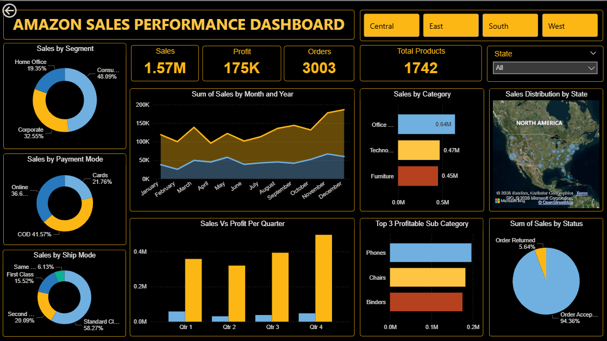

# Amazon Sales Performance Dashboard
This project presents an interactive Power BI dashboard analyzing Amazon sales data to identify trends in revenue, profit, and product performance.
## Tools Used
- Power BI
- DAX
- Excel
## Key Insights
- Sales and profit trends
- Regional sales performance
- Category analysis
- Order trends over time

## Dashboard Features
- KPI cards for sales, profit, and orders
- Interactive slicers and filters
- Geographic sales visualization
